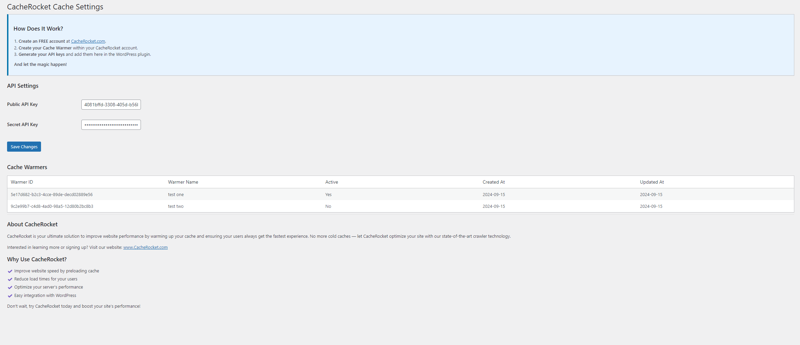

# CacheRocket - the most advanced Cache Warming

**Contributors**: NOOBBase  
**Tags**: cache, performance, SEO, speed optimization, cache warming  
**Requires at least**: 5.5  
**Tested up to**: 6.6  
**Stable tag**: 1.0.0  
**License**: GPLv2 or later  
**License URI**: https://www.gnu.org/licenses/gpl-2.0.html

CacheRocket is a WordPress plugin that proactively warms your cache.

## Description

CacheRocket is a powerful WordPress plugin that helps you warm your site’s cache, ensuring optimal performance for your users and faster page load times. By proactively warming the cache, CacheRocket minimizes the chances of slow responses due to expired or cold cache data, providing a smooth and speedy browsing experience.

### Key Features:

- **Automated Cache Warming**: Proactively warm your website’s cache at regular intervals.
- **Supports Multiple Caching Plugins**: Compatible with popular caching plugins such as WP Super Cache, W3 Total Cache, and others.
- **Customizable Caching Schedule**: Configure the frequency of cache warming based on your site’s needs.
- **Cache Log Reports**: Monitor cache warming activities with detailed logs.
- **SEO Optimization**: Improve your SEO by ensuring that cached pages are always pre-warmed for faster responses.

## Installation

### Method 1: Upload via WordPress Admin

1. Download the plugin `.zip` file.
2. In your WordPress admin dashboard, navigate to **Plugins > Add New**.
3. Click **Upload Plugin** and choose the downloaded `.zip` file.
4. Click **Install Now** and then activate the plugin.

### Method 2: Install from the WordPress Plugin Directory

1. In your WordPress admin dashboard, go to **Plugins > Add New**.
2. Search for `CacheRocket`.
3. Click **Install Now** and activate the plugin.

## Usage

1. After activation, navigate to the **CacheRocket** settings page under **Settings > CacheRocket**.
2. Configure your cache warming settings:
   - Create your FREE account at CacheRocket.com. You really can start free.
   - Add your API keys obtained from https://cacherocket.com/account.
   - Add the API Key in your wordpress CacheRocket settings
   - Save and enjoy the connection to Cache rocket

The plugin makes API calls tot the CacheRocket API to fetch all your existing Cache warmers. We will add more functions and features so you can fully operated your cache Warmers from your wordpress installation. But we need some more tie for this.

### Frequently Asked Questions

**Q: What is cache warming?**  
A: Cache warming is the process of pre-fetching and storing web pages in cache before a user requests them, ensuring fast load times for subsequent visitors.

**Q: Will CacheRocket work with my existing caching plugin?**  
A: Yes! CacheRocket is designed to work with popular caching plugins such as WP Super Cache, W3 Total Cache, and more.

**Q: How often should I run cache warming?**  
A: It depends on your site's traffic and content update frequency. For most websites, daily cache warming works well. High-traffic sites or sites with frequent updates might benefit from more frequent cache warming.

## Screenshots

1. **CacheRocket Settings Panel**  
   

## Changelog

### 1.0.0

- Initial release of CacheRocket.
- Added support for automated cache warming.
- Integrated with popular caching plugins.

## Upgrade Notice

### 1.0.0

- First version of CacheRocket. Install to start improving your cache performance.

## Support

For support, please contact us at [support@cacheRocket.com](mailto:support@cacheRocket.com) or open a support ticket in the [WordPress support forum](https://wordpress.org/support/plugin/cacheRocket). If you want to learn more about our terms and conditions please visit: https://cacherocket.com/terms-and-conditions

## License

This plugin is licensed under the GPLv2 (or later). You can read more about this license [here](https://www.gnu.org/licenses/gpl-2.0.html).

---

**Improve Your Site Performance Today with CacheRocket!**
